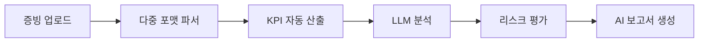

# SmartChain ESG

<div align="center">


**AI 기반 공급망 ESG 실사 자동화 플랫폼**

*AI 기술로 공급망 전체의 ESG 컴플라이언스와 리스크 평가를 자동화합니다*

[](https://opensource.org/licenses/MIT)
[](http://makeapullrequest.com)
[](https://github.com/smartchain-esg)

[주요 기능](#-주요-기능) • [아키텍처](#-아키텍처) • [레포지토리](#-레포지토리) • [팀 소개](#-팀-소개)

</div>

---

## 🎯 프로젝트 개요

**SmartChain ESG**는 AI 기반 자동화를 통해 공급망 ESG 관리를 혁신하는 엔터프라이즈급 SaaS 플랫폼입니다. B2B 환경에 최적화되어, 원청 기업이 수천 개의 협력사에 대한 ESG 실사를 효율적으로 관리하고 EU CSDDD와 같은 글로벌 규제를 준수할 수 있도록 지원합니다.

### 🔥 해결하는 핵심 과제

| 과제 | 우리의 솔루션 |
|------|--------------|
| 🏭 **규모**: 3,000개 이상 협력사 수동 관리 | **6.5배 커버리지 확장** (자동화 워크플로우) |
| 💰 **비용**: 141억 원 잠재적 운영 비용 | **검증 시간 90% 단축** (120분 → 10분) |
| 📊 **데이터 무결성**: 수기 입력의 조작 가능성 | **증빙 기반 자동 파싱** 및 검증 |
| 🌍 **컴플라이언스**: 2027년 EU CSDDD 시행 | **규제 대응 완료** 플랫폼 및 추적 시스템 |

---

## ✨ 주요 기능

### 🤖 **AI 기반 인텔리전스**



- **📄 다중 포맷 파싱**: PDF/Excel/Word/이미지에서 데이터 자동 추출
- **🧮 스마트 KPI 엔진**: 산업 표준 공식(GHG Protocol, ESRS) 기반 자동 계산
- **💬 자연어 인사이트**: RAG 기반 참조가 포함된 LLM 생성 성과 요약
- **⚠️ 지능형 리스크 분류**: 투명한 근거를 가진 3단계 위험군 등급(저/중/고)

### 🔐 **엔터프라이즈급 보안**

- **RBAC 시스템**: 5단계 역할 관리(게스트/기안자/결재자/수신자/관리자)
- **감사 추적**: 모든 사용자 행동과 데이터 수정에 대한 포괄적 로깅
- **데이터 무결성**: SHA-256 해싱 + 불변 증빙 저장소
- **컴플라이언스**: TLS 암호화, GDPR 준수 데이터 보관 정책

### 📦 **완전한 데이터 패키지**

```json
// data.zip 구조
{
  "manifest.json": "SHA-256 체크섬이 포함된 파일 목록",
  "diagnostic_result.json": "정성/정량 평가 결과",
  "kpi_result.json": "배출계수가 포함된 계산된 지표",
  "evidence_files/": "원본 업로드 문서",
  "audit_trail.csv": "완전한 수정 이력"
}
```

### 🎨 **역할 기반 워크플로우**

| 역할 | 주요 기능 |
|------|----------|
| 👔 **기안자** (협력사 담당자) | 증빙 업로드, 자가진단 완료, 검수 제출 |
| ✅ **결재자** (협력사 팀장) | 품질 확인, 수정 요청, 원청 제출 승인 |
| 🔍 **수신자** (원청 ESG팀) | 최종 심사, 위험군 등급 결정, 보고서 승인 |
| ⚙️ **관리자** (시스템 관리자) | 규칙 설정, 캠페인 관리, 컴플라이언스 감독 |

---

## 🏗️ 아키텍처

```
┌─────────────────────────────────────────────────────────────────┐
│                        프레젠테이션 레이어                        │
│  ┌──────────────────────────────────────────────────────────┐  │
│  │  React + TypeScript (Frontend Repository)                │  │                            
│  │  - Tailwind CSS + shadcn/ui                              │  │
│  │  - React Query 상태 관리                                  │  │
│  └──────────────────────────────────────────────────────────┘  │
└─────────────────────────────────────────────────────────────────┘
                              ↕ REST API
┌─────────────────────────────────────────────────────────────────┐
│                       애플리케이션 레이어                         │
│  ┌──────────────────────────────────────────────────────────┐  │
│  │  FastAPI Backend (Backend Repository)                    │  │
│  │  - Pydantic 검증을 포함한 RESTful API                     │  │
│  │  - JWT 인증 + RBAC 미들웨어                               │  │
│  │  - 비동기 작업 큐                                         │  │
│  └──────────────────────────────────────────────────────────┘  │
└─────────────────────────────────────────────────────────────────┘
                              ↕ Internal API
┌─────────────────────────────────────────────────────────────────┐
│                          AI 레이어                               │
│  ┌──────────────────────────────────────────────────────────┐  │
│  │  AI Service (AI Repository)                              │  │
│  │  - LangChain + Azure OpenAI (GPT-4)                      │  │
│  │  - Chroma를 활용한 RAG 파이프라인                         │  │
│  │  - 문서 파서 (PyPDF2, openpyxl, python-docx)             │  │
│  │  - OCR 엔진 (clova OCR)                                  │  │
│  └──────────────────────────────────────────────────────────┘  │
└─────────────────────────────────────────────────────────────────┘
                              ↕ Data Layer
┌─────────────────────────────────────────────────────────────────┐
│                        데이터 레이어                             │
│  ┌──────────────┐  ┌──────────────┐  ┌──────────────────────┐ │
│  │ PostgreSQL   │  │ Azure Blob   │  │ Redis Cache          │ │
│  │ (관계형 DB)  │  │ (파일 저장)  │  │ (세션/큐)            │ │
│  └──────────────┘  └──────────────┘  └──────────────────────┘ │
└─────────────────────────────────────────────────────────────────┘
```

### 🛠️ 기술 스택

| 레이어 | 기술 |
|-------|------|
| **프론트엔드** | React, Vite, TypeScript, React Query, Tailwind CSS |
| **백엔드** | Spring Boot, Java, Pydantic, Celery, Redis |
| **AI/ML** | LangChain, Azure OpenAI, Chroma, PyTorch, pandas |
| **데이터베이스** | PostgreSQL (Azure Database), Azure Blob Storage |
| **인프라** | Azure App Service, Azure Functions |

---

## 📚 레포지토리

### 🎨 [Frontend](https://github.com/KT-Cloud-ESG-Platform/Frontend)
```bash
# 엔터프라이즈 UI/UX를 갖춘 모던 React SPA
- React + Vite
- 역할 기반 페이지 라우팅
- 진행률 표시 실시간 파일 업로드
- 인터랙티브 데이터 시각화
```

### ⚙️ [Backend](https://github.com/KT-Cloud-ESG-Platform/Backend)
```bash
# 고성능 REST API
- 공식 버전 관리를 포함한 KPI 계산 엔진
- PostgreSQL
- 비동기 작업을 위한 Celery
- JWT + RBAC 인증
```

### 🤖 [AI Service](https://github.com/KT-Cloud-ESG-Platform/AI)
```bash
# 지능형 문서 처리 및 분석
- 다중 포맷 파서 (PDF/Excel/Word/Image)
- 출처 추적 기능이 있는 RAG 기반 LLM 코멘트
- 리스크 평가 ML 모델
```
---

## 📊 Key Metrics & Impact

## 📊 주요 지표 및 영향력

### 비즈니스 임팩트

| 지표 | 이전 | 이후 | 개선률 |
|------|------|------|--------|
| **협력사 커버리지** | 516개 사 | 3,354개 사 | **+549%** |
| **검증 시간** | 120분/사 | 10분/사 | **-92%** |
| **비용 절감** | - | 141억 원/년 | **운영 효율화** |
| **데이터 정확도** | 수동 (70%) | 자동화 (95%+) | **+25%** |

### 기술 성능

- ⚡ **API 응답 시간**: < 3초 (95번째 백분위수)
- 📈 **동시 접속 사용자**: 1,000명 이상 지원
- 🔄 **가동률**: 99.5% SLA
- 🗂️ **파일 처리**: 최대 50MB, 10개 이상 포맷 지원

---

## 👥 팀 소개

**KT AIVLE School 8기 - 10조 (수도권 5반)**

| 역할 | 이름 | GitHub | 담당 업무 |
|------|------|--------|----------|
| 🎯 **조장 & PM** | 이종헌 | [@github](https://github.com/jjongjjongR) | 프로젝트 관리, 아키텍처 설계 |
| 🔧 **인프라 리더** | 이수오 | [@github](https://github.com/) | Azure 배포, CI/CD, 영상 제작 |
| 🎨 **풀스택 리더** | 진지현 | [@github](https://github.com/) | UI/UX 구현, 상태 관리 |
| 🖥️ **풀스택 개발자** | 박세용 | [@github](https://github.com/) | 컴포넌트 개발, 통합 |
| 💻 **풀스택 개발자** | 김건우 | [@github](https://github.com/) | API 개발, 데이터베이스 설계 |
| 🤖 **AI/ML 리더** | 이수빈 | [@github](https://github.com/) | LLM 통합, RAG 파이프라인, ML 모델 |
| 📊 **데이터 엔지니어** | 배수한 | [@github](https://github.com/) | 데이터 처리, KPI 엔진, 파서 |

---

## 📄 라이선스

이 프로젝트는 MIT 라이선스 하에 있습니다. 자세한 내용은 [LICENSE](LICENSE) 파일을 참조해주세요.

---

## 🔗 링크

- 📖 [전체 문서](https://docs.smartchain-esg.com)
- 🎥 [데모 영상](https://youtube.com/watch?v=...)
- 📊 [프로젝트 발표자료](https://www.slideshare.net/...)
- 💬 [Notion](https://discord.gg/...)

---

<div align="center">

**KT AIVLE School 8기가 ❤️로 만들었습니다**

</div>
